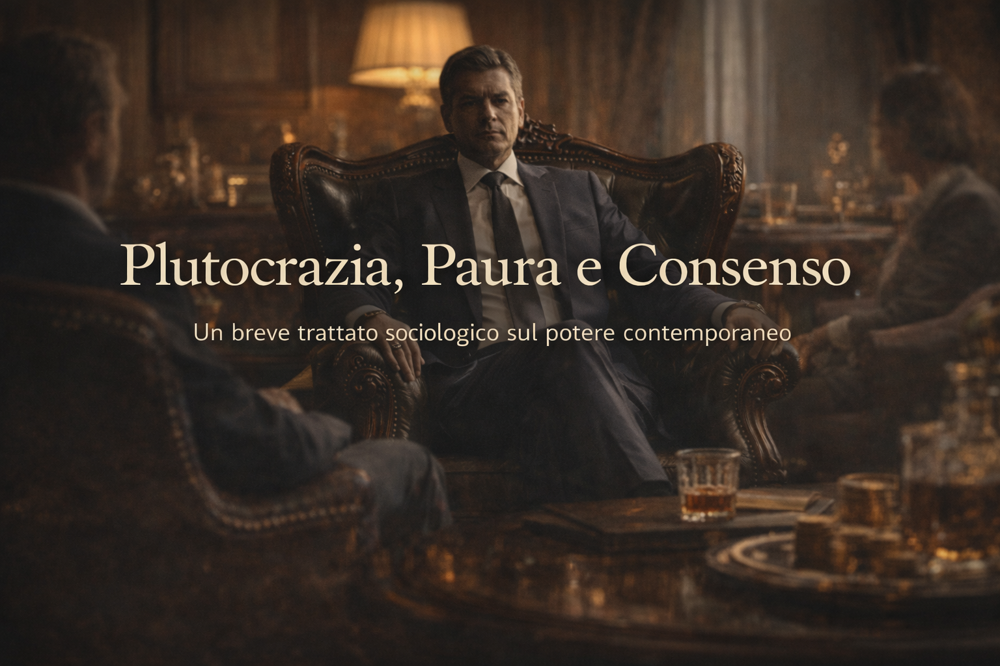

# Plutocrazia, Paura e Consenso
*Un breve trattato sociologico sul potere contemporaneo*

Viviamo in una fase storica in cui la concentrazione della ricchezza ha raggiunto livelli senza precedenti.  
Una ristretta minoranza della popolazione mondiale controlla una quota sproporzionata delle risorse economiche, finanziarie e simboliche, mentre la maggioranza sperimenta una progressiva perdita di sicurezza, diritti e prospettive.

Questo assetto non si regge solo sulla forza economica, ma su un meccanismo più sottile: il consenso di chi ne subisce gli effetti negativi.

Il dato centrale è il seguente: circa il dieci per cento della popolazione mondiale detiene la gran parte della ricchezza globale.  
All’interno di questo gruppo, una frazione ancora più ridotta esercita un’influenza decisiva sulle politiche pubbliche, sui mercati e sulla narrazione dominante.  
Non siamo di fronte a un complotto, ma a una struttura sistemica.

Il paradosso sociologico più rilevante è che il ceto medio impoverito tende a identificarsi con l’élite economica, considerandola un modello di successo e non un’anomalia.  
Questa identificazione è di tipo aspirazionale: l’individuo non si percepisce come povero, ma come temporaneamente escluso dal successo.

Parallelamente, la frustrazione sociale viene indirizzata verso obiettivi più deboli e visibili: i poveri, gli immigrati, le minoranze.  
Si crea così un conflitto orizzontale che distoglie l’attenzione dal conflitto verticale, ovvero dalla reale distribuzione del potere e della ricchezza.

In questo contesto, l’immigrato svolge una funzione doppia.  
Da un lato è una risorsa economica essenziale: forza lavoro a basso costo, contributi previdenziali, compensazione del declino demografico.  
Dall’altro lato è un nemico simbolico, utile a generare paura e consenso politico.

La paura dell’altro, spesso declinata in chiave culturale o religiosa, non nasce da dati empirici ma da narrazioni semplificate.  
La realtà quotidiana mostra una convivenza molto più complessa e integrata di quanto venga rappresentato nel discorso pubblico.

A livello geopolitico, il rapporto tra Occidente e mondo islamico è fortemente sbilanciato.  
Interventi militari, colonialismo, doppi standard e alleanze selettive hanno contribuito a creare instabilità e risentimento.  
Ciò non giustifica la violenza, ma ne spiega il contesto.

Il sistema attuale può essere definito come plutocratico o oligarchico: pochi decidono, molti competono tra loro.  
È un modello sorprendentemente stabile perché trasforma l’insicurezza economica in paura identitaria.

La vera fragilità di questo sistema non è la povertà estrema, ma la perdita di speranza del ceto medio.  
Quando il ceto medio smette di credere nella mobilità sociale e nella possibilità di miglioramento, il consenso si incrina.

**Conclusione**  
Non viviamo in un mondo governato esclusivamente dai ricchi, ma in un mondo in cui una parte consistente dei non ricchi difende attivamente un sistema che li impoverisce.  
È questa interiorizzazione del dominio che rende il sistema così resistente e, allo stesso tempo, così vulnerabile nel lungo periodo.

